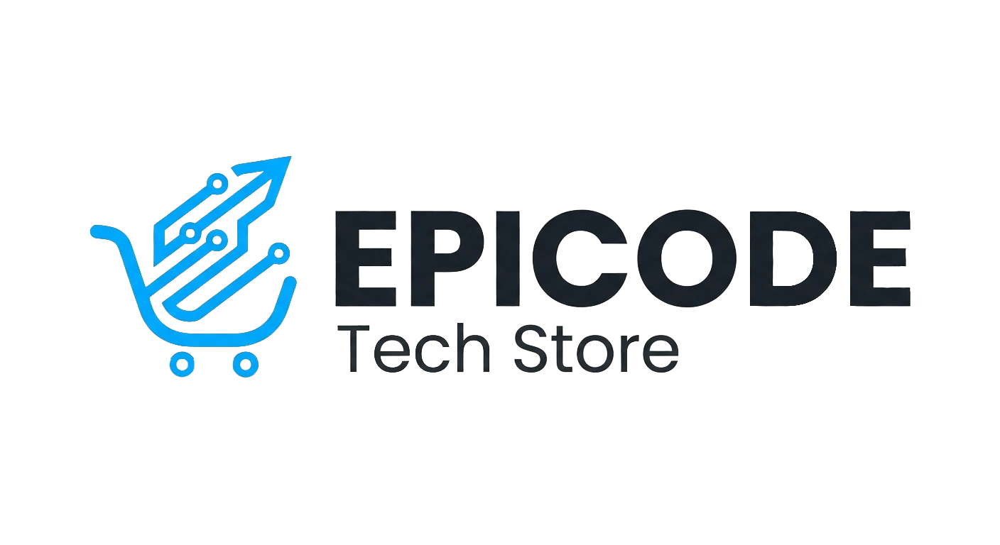
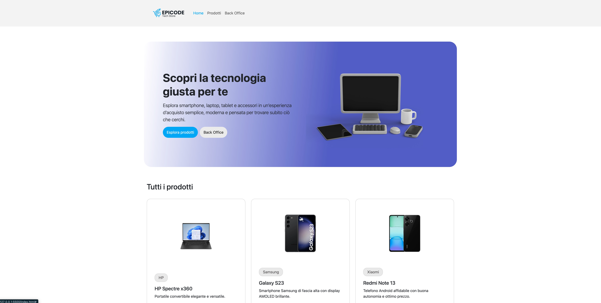

# Tech Store E-Commerce

<p align="center">
  <a href="https://github.com/EmanWeBdV/EPICODE_M4-W4D4">
    
  </a>
</p>

<p align="center">
  A responsive <strong>tech e-commerce web app</strong> built with HTML, CSS and JavaScript.<br/>
  Focus on product rendering, single product details, CRUD operations and back-office management.<br/>
  <strong>This project was created during Module M4 of the Epicode course.</strong>
</p>

<p align="center">
  <a href="https://github.com/EmanWeBdV/EPICODE_M4-W4D4">
    
  </a>
  <a href="https://github.com/EmanWeBdV/EPICODE_M4-W4D4/issues">
    
  </a>
  <a href="#">
    
  </a>
</p>

<p align="center">
  <a href="#-preview">Preview</a>
  ·
  <a href="#-demo">Demo</a>
  ·
  <a href="https://github.com/EmanWeBdV/EPICODE_M4-W4D4/issues">Report a bug</a>
  ·
  <a href="https://github.com/EmanWeBdV/EPICODE_M4-W4D4/issues">Request a feature</a>
</p>

---

## ✨ Preview

<p align="center">
  
</p>

---

## 🔗 Demo

- **Live demo:** https://emanwebdv.github.io/EPICODE_M4-W4D4/

---

## 🧭 Table of Contents

- [Preview](#-preview)
- [Demo](#-demo)
- [Features](#-features)
- [Tech Stack](#-tech-stack)
- [Project Structure](#-project-structure)
- [Installation](#-installation)
- [Usage](#-usage)
- [Pages Overview](#-pages-overview)
- [Back Office Features](#-back-office-features)
- [Responsiveness](#-responsiveness)
- [Roadmap](#-roadmap)
- [Author](#-author)
- [License](#-license)
- [Disclaimer](#-disclaimer)

---

## 🚀 Features

- **Tech store homepage**
  - Modern hero section
  - Product listing area
  - CTA buttons for product exploration and back office access

- **Products page**
  - Dynamic product loading
  - Product cards with image, title, brand and price
  - Clean card-based layout for catalog browsing

- **Single product page**
  - Dedicated product detail view
  - Product image and full information
  - Focused layout for product presentation

- **Back office management**
  - Form to add new products
  - Edit existing products
  - Delete products from the database
  - Product table with preview, name, brand, description, price and actions

- **Delete confirmation modal**
  - Warning modal before removing a product
  - Safer management flow for destructive actions

- **Modern UI styling**
  - Gradient hero sections
  - Rounded buttons and containers
  - Clear visual distinction between user-facing area and management area

- **Educational Context**
  - Built as a frontend exercise to practice CRUD logic, form handling, product rendering and multi-page app structure

---

## 🧱 Tech Stack

<p align="left">
  
  
  
  
</p>

---

## 📂 Project Structure

```bash
.
├── index.html
├── product.html
├── back-office.html
├── assets
│   ├── css
│   │   └── style.css
│   ├── js
│   │   └── script.js
│   └── ...
├── .gitignore
└── README.md
